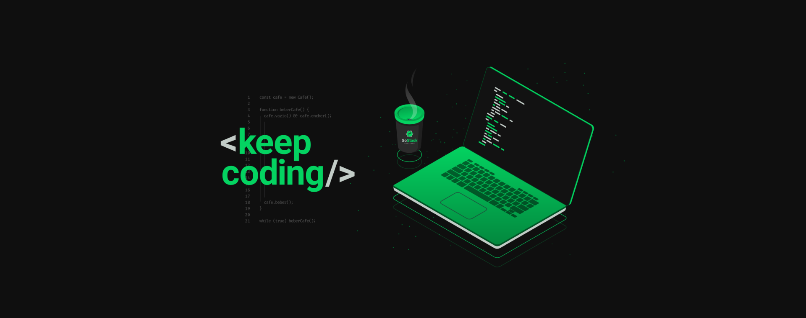
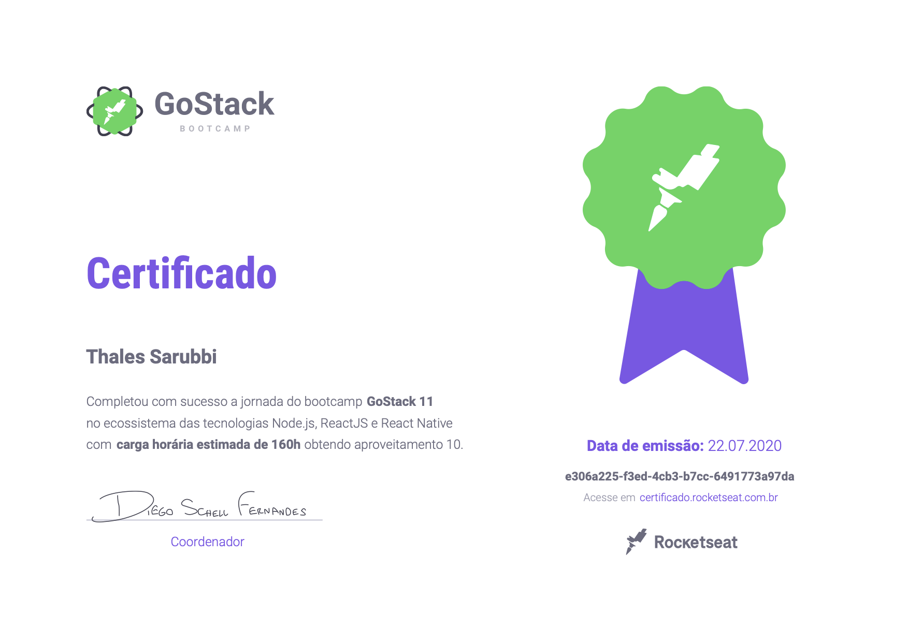

<h1 align="center">
    
     
    GoStack
     
</h1>

    <h4 style="margin-bottom: 0;"> 🏁  Finished.  🏁</h4>
    <h5 style="margin-top: 0;">(for now)</h5>

GoStack is a immersive training in the most modern web and mobile development technologies.
 
Stack: React | React Native | Node.js

## 📝 Certificate
---
 

  

## ✍️ Author
---
 

 
<b>Thales Sarubbi</b>

Made with 💙 by Thales Sarubbi 🗣 Let's talk!

 
